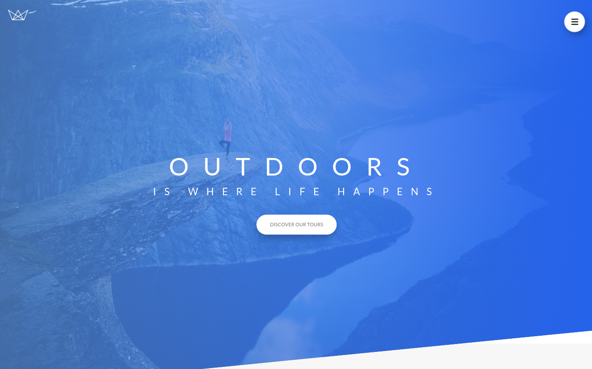

<h1 align="center">
  DaTours
</h1>
<div align="center">
  
</div>


## Description

DaTours is webapp that enables travelers to plan, book, and manage their trips. These apps provide a one-stop-shop for users to research, book, and organize tours, activities, and experiences in destinations around the world.ep

## Built With

- [React.js]
- [Tailwindcss]
- [Sass]

## 🛠 Installation & Set Up

1. Clone the repo
   ```sh
   git clone https://github.com/rdhss/DaTours.git
   ```
1. change dir
   ```sh
   cd DaTours
   ```
2. Install NPM packages
   ```sh
   npm install
   ```
3. Start the Application
   ```sh
   npm start
   ```